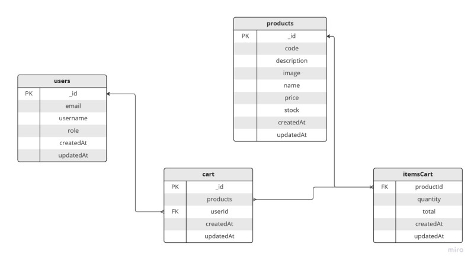

# Ecommerce MEXN 

MERN Ecommerce v2 using typescript, design patterns and SOLID. Documented with Swagger. 

## API structure
    .
    ├── husky                   # Better commits
    ├── docs                    # Documentation files 
    ├── src                     # Source files
        └── api                 # Modular structure    
            ├── auth              
            ├── cart               
            ├── products        
            └── users         
    ├── .env                    # Environment variables
    ├── .eslint                 # Format code
    └── README.md

## Swagger

Check endpoints with SWAGGER UI

```
api/v1/docs
```

## Run project

#### 1. Clone project

#### 2. Install dependencies

```
yarn install
```

#### 3. Clone `.env.template` and rename to `.env`

#### 4. Use mongo to set up your database

#### 5. Run dev mode

```
yarn run dev
```

## DB Diagram



## Tech Stack

**Server:** Node, Express, MongoDB, Typescript, Zod, Eslint/prettier, Husky

## 🚀 About Me

I am a student of Computer Engineering at UNLaM.
I am currently working as a Programmer Analyst at Banco ITAU @ CuentaChat Squad.

At the same time, I am training as a Full Stack MERN developer in a self-taught way.

[](https://www.linkedin.com/in/antonellifd/)